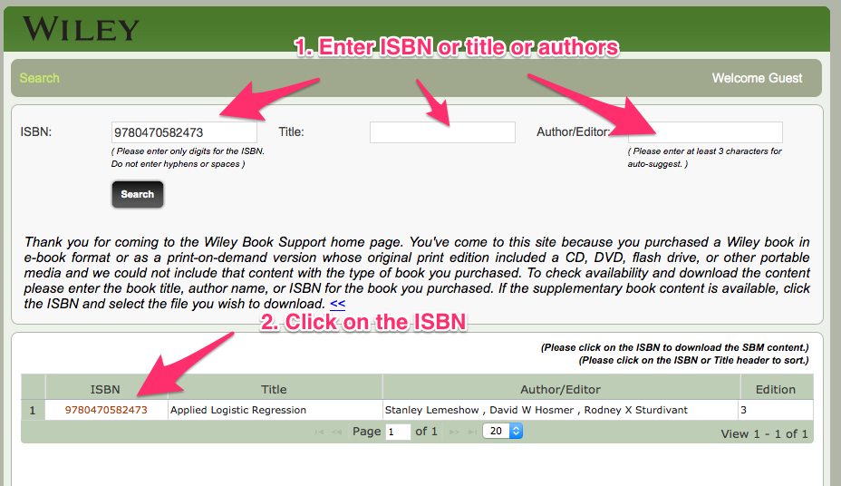
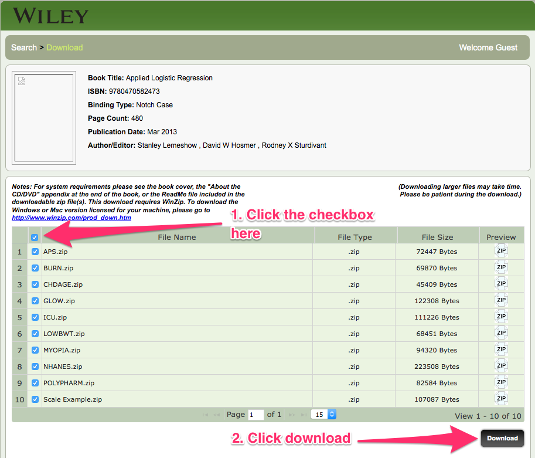

```{r echo=FALSE, eval=FALSE}
opts_chunk$set(comment=NA, fig.width=6, fig.height=6)
```

A good reference about using R for Logistic Regression is [http://www.ats.ucla.edu/stat/r/dae/logit.htm](http://www.ats.ucla.edu/stat/r/dae/logit.htm)

## Preliminaries

 + These are my notes for the lectures of the [Coursera course "Introduction to Logistic Regression"](https://class.coursera.org/logisticregression-001/) by Professor Stanley Lemeshow. The goal of these notes is to provide the R code to obtain the same results as the Stata code in the lectures. 
 
 + I use (and strongly recommend) [RStudio](http://www.rstudio.com/) to do all my work in R. I wrote them with a *work-in-progress* R user in mind (that means, non-absolute newbie but non-expert either). There are now hundreds of ways of learning R. I  recommend the course [R Programming](https://www.coursera.org/course/rprog) by R. Peng, J. Leek and B. Caffo (the course is part of the *Data Science Specialization*, which I also recommend if you are willing to learn a lot about data science using R). Also, the [Open Intro Statistics](https://www.openintro.org/index.php) R labs can be useful. I have also often found the following websites very useful:  
    * [R resources at the Institute for Digital Research and Education, UCLA](http://www.ats.ucla.edu/stat/r/)
    * [Quick-R by Robert Kabacoff](http://www.statmethods.net/)
    * [R-Tutorial by Chi Yau](http://www.r-tutor.com/)
    * [R-Tutorials by William King](http://ww2.coastal.edu/kingw/statistics/R-tutorials/)
  
 + The data files for the course (in txt format) can be found at the Wiley website  
[http://wiley.mpstechnologies.com/wiley/BOBContent/searchLPBobContent.do](http://wiley.mpstechnologies.com/wiley/BOBContent/searchLPBobContent.do)  
You can enter the authors name or the book title or the ISBN number 9780470582473.  
</br>
  
</br>
Then click on the checkbox to select all the files and click on *Download*  
</br>
  
</br>
You will get a zip file with the data files. Unzip the file. I assume that you have selected a folder for this course and that you have instructed R to use that folder as your working folder (in RStudio there's a menu option for doing that; alternatively you can use the `setwd` function). I keep my R scripts in that folder, while the data files are located in a `data` subfolder. The code belows assumes that you have the same setup. 

 + The notes are written in [Rmarkdown](http://rmarkdown.rstudio.com/), which is based on [knitr](http://yihui.name/knitr/). The R code appears in darker grey boxes, while the output appears below in white boxes (the output appears here prefixed with ##, but that's not really part of R output; see the Rmarkdown and knitr references for details). The important thing is that you can copy the code from the grey boxes, paste it into R and execute it directly.   

## Loading and exploring the data

We begin by loading the data in the CHDAGE.txt file. In my case the file is located in a subfolder called data, inside the R work folder. You may need to learn how to set the working directory in R (in RStudio there's a menu option for this under *Session*) and adapt the following command to your setup.

```{r}
CHDdata = read.table("./data/CHDAGE.txt", header = TRUE)
```

Now `CHDdata` is a `data.frame`, which is the basic R data structure for holding data tables. You can see the first few rows (I chose 10 rows) of the data table using the `head` function (there's also a `tail` function to see the last values):

```{r}
head(CHDdata, 10)
```

If you want a spreadsheet-like view of the data you can execute:

```{r eval=FALSE}
View(CHDdata)
```

The `summary` and `str` functions are helpful when starting to explore a new data set:

```{r}
summary(CHDdata)

str(CHDdata)
```

You can see from the output that the data set has three variables: 

 + `ID` is simply an integer identifier. 
 + `AGE` is coded as an integer. 
 + `CHD` (for coronary heart disease) is also a (binary) integer variable, taking only the values 0 and 1. 


In R you use the `$` syntax to access any component variable of a data.frame. For example, if we type 
```{r}
CHDdata$CHD
```
then, as you see, we get a vector containing the values of the variable `CHD` (you can think of this as one of the columns in the data.frame). We will make extensive use of this `$` syntax in the sequel.


### Plotting the data

Let us do a basic plot of the data. With `plot` we can  get a scatter plot of the `CHD` variable (vertical axis, thus second argument of `plot`) vs the `AGE` variable (horizontal axis, thus first argument of `plot`). The `xlab` and `ylab` options allow us to set labels for the plot axis:

```{r}
plot(CHDdata$AGE, CHDdata$CHD, , xlab="Age", ylab="Chd")
```


### Grouping the data into age classes

The range of the `AGE` variable is
```{r}
range(CHDdata$AGE)
```


The `cut` function is used in R to group quantitative variables into ordered classes. In order to use it we need to define the breaks that separate classes. In R you can get a basic sequence of integers using syntax such as `-5:5` (that gives `r -5:5` as output). But for more sophisticated sequencing you'll want to learn to use `seq`, which is far more powerful. The first $20-29$ and last $60-69$ classes are longer than the others. Thus I begin by creating a sequence of breaks from 30 to 60 with a step size of 5: 

```{r}
(AGEbreaks = seq(from = 30, to = 60, by = 5))
```

The outer parenthesis that I used here are just a way of asking R to print the result of an assignment (otherwise R simply assigns the result to a variable silently). Now I manually add 20 at the beginning and 70 at the end:

```{r}
(AGEbreaks = c(20,AGEbreaks, 70))
```

Now we are ready to use `cut`. The table in slide 6 of the course lecture notes implies that the age intervals are left-closed/rigth-open intervals, such as $[35, 40)$ (or $35 \leq AGE < 40$ if you like). To get that behavior in R you need the `right = FALSE` option in `cut` (the default is rigth-closed intervals). 
```{r}
CHDdata$AgeGroup = cut(CHDdata$AGE, breaks = AGEbreaks, right = FALSE)
```
You will notice that I used `CHDdata$AgeGroup` with a `$` in it. This has the benefit of directly including the `AgeGroup` variable into the data.frame. You can check this with:

```{r}
head(CHDdata)
tail(CHDdata)
```
Note that the rows are sorted by age in this data set.

#### Frequency Table for Age Groups

The basic frequency table is:
```{r}
(table1 = table(CHDdata$AgeGroup))
```
You don't really need here the assignment part `table1 = `. But I will be putting all the tables together below, and this assignment is an easy way to do that.

The table of CHD absence/presence by age group can be obtained with:
 
```{r}
(table2 = table(CHDdata$CHD, CHDdata$AgeGroup))
```

and to get the mean (proportion) by age group we use this: 

```{r}
(table3 = tapply(CHDdata$CHD, INDEX = CHDdata$AgeGroup, FUN = mean))
```

Finally, if you want to see them all in a single table, like the one in the lectures, you can use `cbind` to bind the tables as columns:

```{r}
table4 = cbind(as.vector(table1), t(table2), table3)
colnames(table4) = c("n", "CHD absent", "CHD present", "mean % present")
addmargins(table4, margin = 1)
```
By the way, the total for the last column is meaningless, but I don't want to make the code more complicated just to get rid of it.


We  plot the last column of this table vs the midpoints of the age classes. The midpoints are obtained as follows:
```{r}
midpoints = AGEbreaks[-length(AGEbreaks)] + c(5, rep(2.5, 6), 5)
plot(midpoints, table4[, 4], col="red", pch=19, xlab="", ylab="")
```  

*Explanation:*

  + In R rows and columns of a matrix, or table or data.frame, are selected with brackets. For example `A[ 2, ]` selects the second row  and `A[ , 3]` selects the third column of a tabular object called A.
  + We take all the  brekas excluding the last one. `length(AGEbreaks)` gives the position of the last break. Thus, the last element is selected with `AGEbreaks[-length(AGEbreaks)]` while `AGEbreaks[-length(AGEbreaks)]`  (note the minus sign) selects all the elements but the last one. 
  + We add a vector with the semi-lengths of the intervals. The central ones are all equal to 2.5, so we use `rep` to repeat that value, and the first and last ones are equal to 5.  


## Fitting a Logistic Model to the Data

The next step is fitting the logistic model, using the `glm` function. I have stored the resulting model object in the glmCHD, for an easier access to the model components. The `summary` function provides an initial description of the model:

```{r}
glmCHD = glm(CHD ~ AGE, family = binomial(link = "logit"), CHDdata)
(summGlmCHD = summary(glmCHD))
```

The log likelihood of this model is:

```{r}
logLik(glmCHD)
```

The model curve can be added to the scatter plot of the data  with the `lines` function:

```{r}
plot(CHDdata$AGE, CHDdata$CHD, , xlab="Age", ylab="Chd")
lines(CHDdata$AGE, glmCHD$fitted, type="l", col="red", lwd=3)
```

The variance-covariance matrix of the logistic model can be obtained with:

```{r}
(vcovCHD = vcov(glmCHD))
```
Note that the order of the variables in the matrix rows and columns is reversed with respect to the Stata output in the course lectures. In the next lecture we will see how to obtain confidence intervals for this model. 

## Extra: direct computation of the likelihood function.

This computation is not included in the Stata (or Systat) output shown in the lectures, but I find it instructive to obtain likelihood from first principles. 
Recall that the likelihood function is defined as (slide 14 in the lecture notes):
\[
l(\beta) = \prod_{i=1}^n \pi(x_i)^{y_i}\left(1 - \pi(x_i)\right)^{1- y_i}.
\]
where 
\[
\pi(x_i) = \dfrac{e^{\beta_0 + \beta_1 x_i}}{1 + e^{\beta_0 + \beta_1 x_i}}
\]


We can define a function in R to compute the likelihood. We will rename the variables to X and Y to simplify the expression (and to make it easier to apply the likelihood function to future examples):

```{r}
X = CHDdata$AGE
Y = CHDdata$CHD

likelihood = function(b){
  prod(exp(b[1] + b[2] * X[Y==1]) /(1 + exp(b[1] + b[2] * X[Y==1]))) * prod(1 /(1 + exp(b[1] + b[2] * X[Y==0])))  
}
```

The likelihood function depends on the choice of the coefficients for the logit. We can use `persp` to obtain a three dimensional plot of the likelihood function in the a region close to the values returned by `glm`

```{r fig.align='center', fig.width=6}
b0 = seq(-8, -2, length.out = 60)
b1 = seq(0.06, 0.18, length.out = 60)

likelihood_vect = Vectorize(function(b0, b1)likelihood(c(b0, b1)))

par(mar = c(0.6, 0.1,0.6,0.1))
zp = outer(X = b0, Y = b1, likelihood_vect)
persp(b0, b1, zp, theta=75, phi=20, col="lightblue", xlab="b0", ylab="b1", zlab="Likelihood")
```
The plot confirms that the maximum value of the likelihood corresponds to the logit coefficients returned by `glm`.  To evaluate it for the coefficients obtained with `glm` we store this coefficients in a vector `b` and run the likelihood function on `b`:

```{r}
(b = glmCHD$coefficients)

likelihood(b)

```
Then the log likelihood is:

```{r}
log(likelihood(b))
```

The same result that appears in the lecture notes (and that we obtained before with `logLik`). 

R includes (in the basic libraries) a function `optim` that can be used to optimize functions that depend on several variables. That is, to find the values of the variables that produce a minimum value of the function (if you want to find a maximum, use -f instead; that's why we consider `-likelihood` below). The method used by `glm` is much more efficient, because it is designed for this specific knid of optimzation problems. But I still find it somehow nice to be able to get that optimal value in a different way. 

```{r}
optim(par = c(0, 0), fn = function(x) - log(likelihood(x)))
```
The first component (labeled `$par` for parameters) contains the values that minimize `-log(likelihood)`. As you can see these are (up to some rounding) the same values that we found using `glm`. 

---

Thanks for your attention!


```{r echo=FALSE, eval=FALSE}
## Additional references (books and web sites): 

1. http://sites.stat.psu.edu/~jls/stat544/syllabus.html

```


